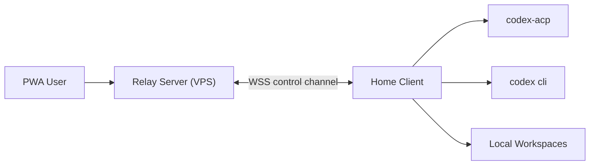
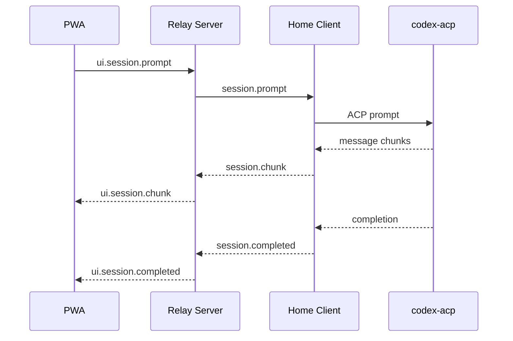
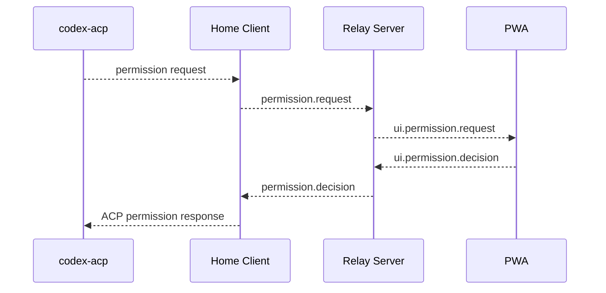

# Remote Codex Architecture

## Goal

Build a remote interaction system with three explicit roles:

- `home client`: runs inside the home/internal network and owns `codex-acp`, `codex cli`, local workspaces, and execution.
- `relay server`: runs on a public VPS and provides authentication, device routing, session coordination, and browser-facing APIs.
- `pwa web`: the user-facing application that connects to the relay server from browsers and mobile devices.

The relay server is a control plane, not an execution plane. All workspace access and command execution stay on the home client.

## Existing Starting Point

The current Rust prototype already implements the hardest local integration boundary:

- it spawns `codex-acp` as a child process
- it creates ACP sessions
- it sends prompts and streams agent output chunks
- it receives permission requests

Today that flow is wired to local `stdin/stdout`. The main architectural change is to replace terminal I/O with a persistent client/server transport while preserving the ACP runtime logic.

## High-Level Topology



### Responsibility Split

#### Home Client

- maintains the outbound persistent connection to the relay server
- registers itself as a device for a user/account
- starts and supervises `codex-acp` / `codex cli`
- owns ACP session state and local working directory mappings
- executes prompts, streams chunks, collects outputs, and surfaces permission requests
- enforces local policy for which workspaces are exposed

#### Relay Server

- authenticates browser users and home clients
- binds users to one or more registered home clients
- terminates browser WebSocket connections
- routes commands from browser sessions to the correct home client
- persists user/session metadata and optionally event logs
- fans out streamed updates from the home client to the PWA

#### PWA Web

- provides chat/session UI
- shows device and workspace choices
- displays streamed model output and status
- renders permission requests and collects user decisions
- allows reconnection to existing sessions and session history browsing

## Core Design Principles

- execution remains inside the private network
- the public server never mounts or accesses the private workspace directly
- the home client always initiates the network path outward
- ACP session identifiers are local to the home client
- user intent and approvals flow through the PWA
- permission prompts default to explicit human approval
- the protocol must tolerate browser refreshes and temporary client/server disconnects

## Connection Model

### Home Client to Relay Server

Use a long-lived outbound WebSocket over TLS (`wss`) from the home client to the relay server.

Reasons:

- works well through NAT and residential uplinks
- supports bidirectional streaming
- keeps the transport model aligned with browser connectivity
- simplifies session event push and heartbeats

The home client should reconnect automatically with exponential backoff and resume device registration.

### PWA to Relay Server

Use HTTPS for login and initial metadata fetch, then WebSocket for live session traffic.

Suggested split:

- `HTTPS`: auth, device list, session list, history fetch
- `WSS`: prompt submission, streamed output, permission decisions, live presence

## Device Registration

Each home client is a named device under a user account, for example:

- `home-mac-mini`
- `lab-linux-box`

Registration flow:

1. user signs into the PWA
2. user creates a device enrollment token on the server
3. user starts the home client with that token
4. home client exchanges the token for a persistent device credential
5. server marks the device online when the WSS channel is active

Suggested server-side device metadata:

- `device_id`
- `user_id`
- `display_name`
- `last_seen_at`
- `status`
- `client_version`
- `capabilities`

## Session Model

There are two session layers:

- `relay session`: public logical session known to the PWA and relay server
- `acp session`: execution session local to the home client

The server should never invent or interpret ACP session internals. It only maps:

- `relay_session_id -> device_id -> client_local_session_ref`

Suggested behavior:

- browser asks server to create a new session on a chosen device/workspace
- server sends `session.create` to the home client
- home client creates a local ACP session and returns a client-local reference
- subsequent prompts target the relay session, which the server routes to the mapped device/client session

This preserves the local execution boundary while allowing the browser to reconnect and continue a logical session.

## Workspace Exposure Model

The home client should expose an allowlisted set of workspaces, not arbitrary filesystem paths supplied by the browser.

Recommended model:

- home client config file lists named workspaces
- each workspace has:
  - `workspace_id`
  - display name
  - absolute local path
  - optional policy flags

Example:

```toml
[[workspaces]]
id = "codex-master"
name = "codex_master"
path = "/Users/lipei/Code/codex_master"
```

The PWA only sees `workspace_id` and friendly metadata. The raw path stays local to the client unless intentionally revealed.

## Messaging Protocol

Use a compact JSON envelope first. Move to a binary or protobuf framing only if scale requires it.

Suggested envelope:

```json
{
  "type": "prompt.send",
  "request_id": "req_123",
  "session_id": "relay_sess_123",
  "device_id": "dev_123",
  "payload": {}
}
```

### Relay Server to Home Client

- `client.register.ok`
- `session.create`
- `session.prompt`
- `session.cancel`
- `session.close`
- `permission.decision`
- `ping`

### Home Client to Relay Server

- `client.hello`
- `client.heartbeat`
- `client.status`
- `workspace.list`
- `session.created`
- `session.chunk`
- `session.completed`
- `session.error`
- `permission.request`
- `permission.resolved`
- `pong`

### Browser to Relay Server

- `ui.session.create`
- `ui.session.prompt`
- `ui.permission.decision`
- `ui.session.cancel`
- `ui.subscribe`

### Relay Server to Browser

- `ui.session.created`
- `ui.session.chunk`
- `ui.session.completed`
- `ui.permission.request`
- `ui.session.error`
- `ui.device.status`

## Prompt and Streaming Flow



The home client should stream chunks as they arrive rather than buffering the whole response.

## Permission Flow

The current local prototype auto-selects a permission option. That is not acceptable for the remote architecture.

Default remote behavior:

1. ACP emits a permission request on the home client
2. home client sends `permission.request` to relay server
3. relay server pushes the request to the PWA
4. user chooses allow once / reject once / allow always / reject always
5. relay server sends `permission.decision` to the home client
6. home client resolves the pending ACP permission future



Recommended first-version policy:

- require explicit user action for every permission request
- optionally add workspace-scoped remembered approvals later
- auto-deny on timeout if the browser disconnects or the user never responds

## Reliability and Reconnect Behavior

### Browser Refresh

Browser refresh should not kill the execution session immediately.

Recommended behavior:

- relay server keeps the logical session alive
- browser can resubscribe to the live relay session stream
- if the client is still running the prompt, the server resumes chunk forwarding

### Home Client Disconnect

If the home client disconnects:

- mark the device offline
- stop accepting new prompts for that device
- keep prior relay sessions in a recoverable state
- let the client reconnect and rehydrate device status

First version simplification:

- in-flight prompts fail closed on client disconnect
- completed sessions remain readable from persisted event logs if enabled

### Server Restart

The relay server should persist enough metadata to restore:

- user accounts
- devices
- relay session records
- event offsets or appended event logs if history replay is supported

## Security Model

### Authentication

Recommended baseline:

- user auth on the PWA using a standard session or JWT-based login
- device auth using enrollment token exchange followed by a device credential
- all transport over TLS

### Authorization

Server must verify:

- the browser user owns the selected device
- the target session belongs to the same user
- permission decisions come from the user who owns that session

### Secret Handling

- do not store workspace secrets on the VPS
- keep device credentials on the home client with restricted local file permissions
- rotate enrollment tokens aggressively

### Privacy

Important trade-off:

- a plain relay server can inspect prompts and responses because it forwards them

Recommended first version:

- accept server-visible content for simplicity and debuggability

Possible later version:

- add end-to-end encryption between PWA and home client, with the server only routing ciphertext

## Deployment Model

### Home Client

Deploy as a long-running service:

- `systemd` on Linux
- `launchd` on macOS

Responsibilities:

- reconnect automatically
- restart `codex-acp` when needed
- keep structured logs
- expose health state locally for debugging

### Relay Server

Deploy behind a standard HTTPS reverse proxy such as Nginx or Caddy.

Suggested components:

- API service
- WebSocket relay handler
- relational database for users/devices/sessions
- optional Redis for fan-out or presence if you scale horizontally

### PWA

Serve as static assets from the relay server stack or CDN, backed by the server APIs and WebSocket endpoint.

## Suggested Repository Split

You can keep this repository focused on the home client first, then add separate services later.

Recommended eventual layout:

```text
codex_master/
  home-client/        # Rust; ACP integration and device client
  relay-server/       # API + websocket routing
  pwa-web/            # browser app
  docs/
    remote-architecture.md
```

If you want the smallest next step, keep the current crate and evolve it into `home-client` before adding the other components.

## Incremental Rollout Plan

### Phase 1: Home Client Daemon

Refactor the current Rust prototype so that:

- ACP integration is extracted from terminal I/O
- session manager is a reusable module
- transport is abstracted behind a trait or adapter
- one implementation remains local CLI for debugging
- one implementation speaks WSS to the relay server

Deliverable:

- a headless home client process that can connect to a mock relay

### Phase 2: Minimal Relay Server

Build a single-user, single-device relay server that supports:

- login or a simple bootstrap auth
- device registration
- one browser session
- prompt send and chunk streaming
- permission request and response

Deliverable:

- browser can send a prompt through the VPS and receive a streamed response from the home client

### Phase 3: PWA UX

Add:

- session list
- device list
- workspace picker
- permission modal
- reconnect and session resume behavior

Deliverable:

- usable browser/mobile interaction flow

### Phase 4: Hardening

Add:

- persistent session/event storage
- robust reconnect/resume
- approval policies
- audit logs
- metrics and alerting
- multi-device support

## Open Questions

These are intentionally deferred, not blockers for phase 1:

- should the server persist full transcript content or only metadata?
- should file attachments or patches be streamed inline or uploaded separately?
- how much history replay is needed after reconnect?
- do you want one device active at a time or multiple simultaneously?
- do you want end-to-end encryption in a later phase?

## Recommended Immediate Next Step

Start by turning the current Rust crate into the home client runtime.

Concretely:

1. extract ACP/session logic out of `main.rs`
2. replace direct terminal printing with emitted structured events
3. replace direct stdin reading with inbound command handlers
4. add a WSS transport adapter for relay communication
5. keep a local debug mode for easier development

That path preserves the current working prototype and converts it into the correct role in the new architecture.
